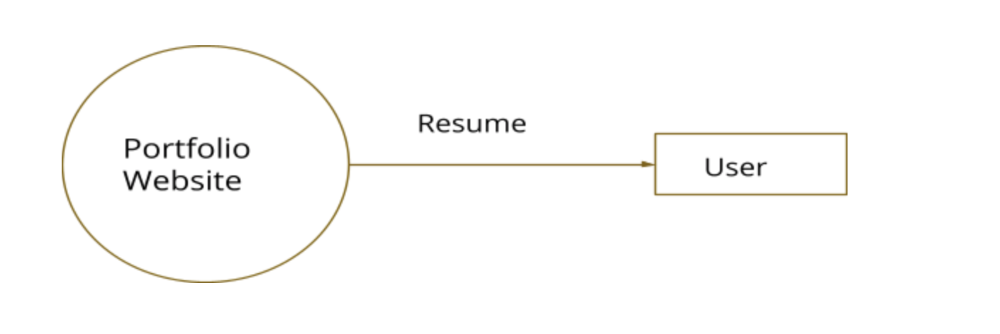

***Portfolio Website***

**Overview**

A portfolio takes the form of a personal website with a collection of
work samples and case studies. It should highlight your skills while
also introducing yourself to your audience --- potential clients, future employers, or just your followers --- both professionally and
personally. It's a space to share what you've accomplished, and, if
you're looking for a new role, what you hope to accomplish next. A great portfolio doesn't only show your work; it tells a story about how you conceptualize and execute solutions to design problems.

 

While online portfolios can be unique and personal, they should always
have a purpose with specific 

goals. This could include any number of the following:

-      You're a new graduate searching for your first role*

-      You're looking to take on freelance work and attract your first
    clients

-      You just want to build a space to document your projects*

-      You want to grow your professional online presence and build a following of your work 

**Goals**

1.  Firstly, you want to be searchable

**Specifications and Requirements**

**FUNCTIONAL REQUIREMENTS**

The basic formula of a portfolio website would include a logo, tagline,
your best work, and contact information.

1.  *A Showcase of Your work*

2.  *About Page*

3.  *Case studies*

4.  *Testimonials*

5.  *Link to download Resume*

6.  *Social media accounts (eg : linkedin)*

**Context Diagram**

**NON FUNCTIONAL REQUIREMENTS**

> 1.Performance
>
>         This is one of the most important considerations especially
> when the project is in the designing phase. Choosing the right
> technology is crucial at this point.
>
> 2\. The portfolio website should be responsive and should support all
> major browsers.           
>
> **SOFTWARE REQUIREMENTS**
>
> OS:  Windows 10 or MacOS
>
> Technologies and frameworks: ReactJS, SASS for CSS,HTML,NodeJS
>
> IDE: Visual Studio Code
>
> **HARDWARE REQUIREMENTS**
>
> Processor: Minimum 1 GHz; Recommended 2GHz or more.
>
> Ethernet connection (LAN) OR a wireless adapter (Wi-Fi)
>
> Hard Drive: Minimum 32 GB; Recommended 64 GB or more.
>
> Memory (RAM): Minimum 1 GB; Recommended 4 GB or above.
